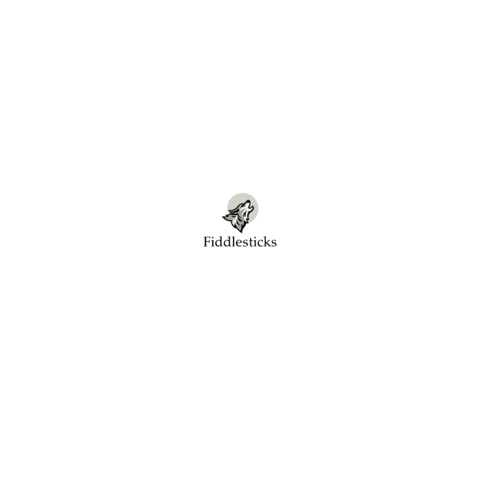

Resources:
- https://www.aporia.com/blog/concept-drift-detection-methods/
- https://practicalml.net/Detecting-data-drift/
- https://www.explorium.ai/blog/understanding-and-handling-data-and-concept-drift/
- https://towardsdatascience.com/detecting-semantic-drift-within-image-data-6a59a0e768c6
- https://link.springer.com/chapter/10.1007/978-3-030-61401-0_12
- https://www.analyticsvidhya.com/blog/2021/10/mlops-and-the-importance-of-data-drift-detection/
- https://arxiv.org/pdf/2004.05785.pdf
- https://umap-learn.readthedocs.io/en/latest/how_umap_works.html
- https://scikit-multiflow.readthedocs.io/en/stable/api/api.html
- https://app.gitbook.com/s/EysdooOE03G65OdltITT/
